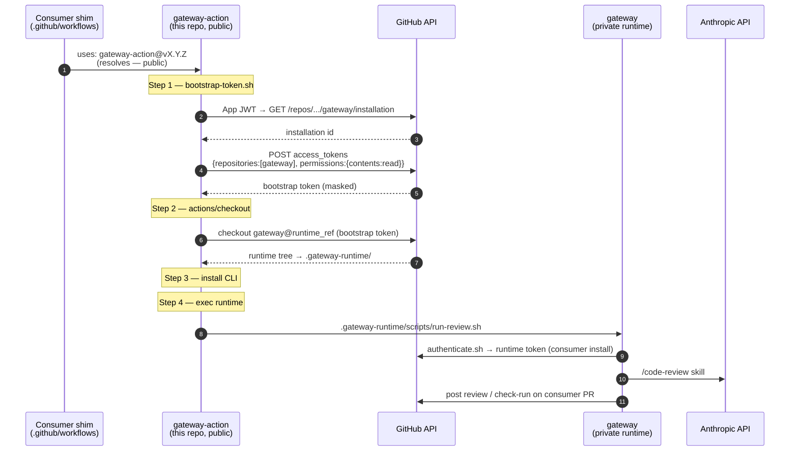

# Architecture — gateway-action

This repo is the **public entry point** for [gateway](https://github.com/lightninglabs/gateway). It carries no review logic. Its only job is to make the bot **resolvable from any consumer repo** — including public ones — and then hand off to the private runtime unchanged.

If you want to understand what the bot *does* (commands, review flow, skill), read [gateway's architecture doc](https://github.com/lightninglabs/gateway/blob/main/docs/architecture.md). This doc explains only the thin resolve-and-fetch layer that lives here.

## The problem this layer solves

A consumer's workflow `uses:` a GitHub action by repo path. GitHub resolves that path with the consumer job's token **before** any step runs. For a *private* action repo, that resolution succeeds only when the org's Actions-access setting (`none` / `organization` / `enterprise`) covers the consumer — and none of those settings ever extend a private repo's actions to a **public** consumer. So a public consumer fails at setup:

```
##[error]Unable to resolve action `lightninglabs/gateway`, not found
```

There is no per-repo allowlist to work around this. The fix is to put the *entry point* in a **public** repo (this one), which every consumer can resolve, and have it fetch the private runtime at run time using credentials the consumer already supplies. See [gateway#27](https://github.com/lightninglabs/gateway/issues/27) for the full design discussion.

## Two tokens, two installations

The single idea that makes this work is that **two different installation tokens** are minted during a run, with different scopes and purposes:

| Token | Minted by | Installation | Scope | Used for |
|-------|-----------|--------------|-------|----------|
| **bootstrap** | `bootstrap-token.sh` (this repo) | the `gateway` repo's own install | `contents:read` on **`gateway` only** | checking out the private runtime |
| **runtime** | `scripts/authenticate.sh` (private runtime) | the **consumer's** install (resolved from the repo, or the optional `installation_id` input) | full review perms (checks/issues/pulls write) | posting the review on the consumer PR |

The consumer's runtime token cannot read `gateway` — it is scoped to the consumer's own repos. That is exactly why the bootstrap token exists. It is the App's own token, minted from the same `app_id` / `private_key` the consumer already passes, but deliberately narrowed to read-only access to one repo.

`bootstrap-token.sh` also **discovers** the gateway installation (`GET /repos/lightninglabs/gateway/installation`, authed with the App JWT) rather than hardcoding the org installation id.

## Run sequence



The composite steps in [`action.yml`](../action.yml):

1. **Mint bootstrap token** — `bootstrap-token.sh` produces a least-privilege, repo-scoped `contents:read` token and masks it in the log.
2. **Checkout runtime** — `actions/checkout` pulls `lightninglabs/gateway` at `runtime_ref` into `.gateway-runtime/`, with `persist-credentials: false`.
3. **Install Claude Code CLI**.
4. **Run gateway** — execs `.gateway-runtime/scripts/run-review.sh`. It resolves all of its siblings relative to its own location (`BASH_SOURCE`), so it runs correctly from any checkout path, and mints the runtime token itself.

## Versioning (lockstep)

This repo is versioned in lockstep with `lightninglabs/gateway`. Each release tag here sets the `runtime_ref` input default to the matching gateway runtime ref. A given `gateway-action` SHA therefore maps deterministically to one runtime version — consumers track a single version axis. The `runtime_ref` input exists only as an override for testing an unreleased runtime.
